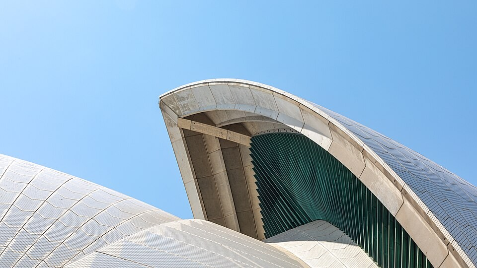
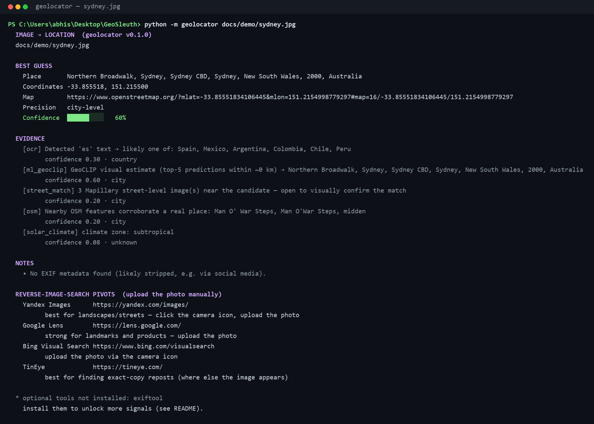
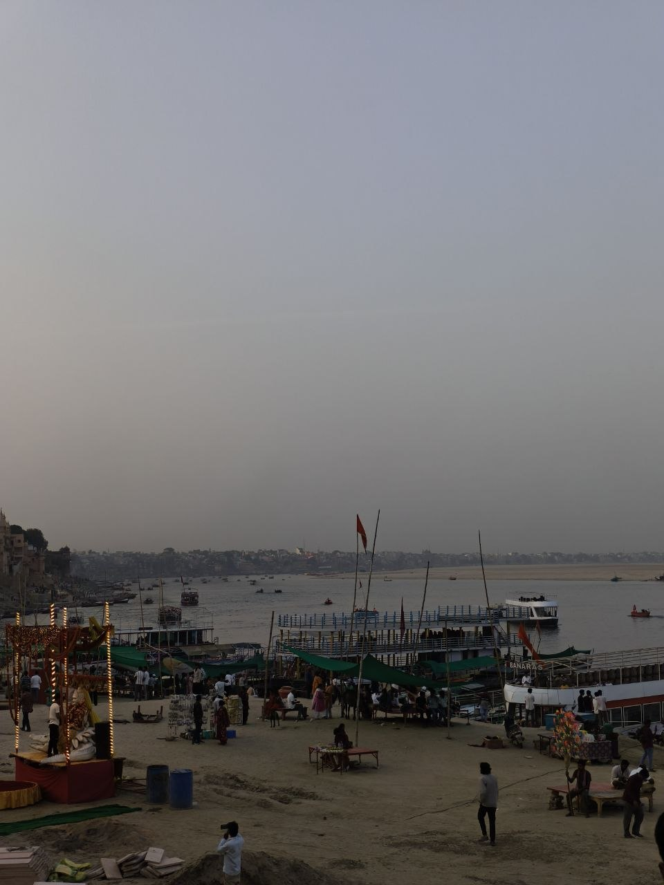
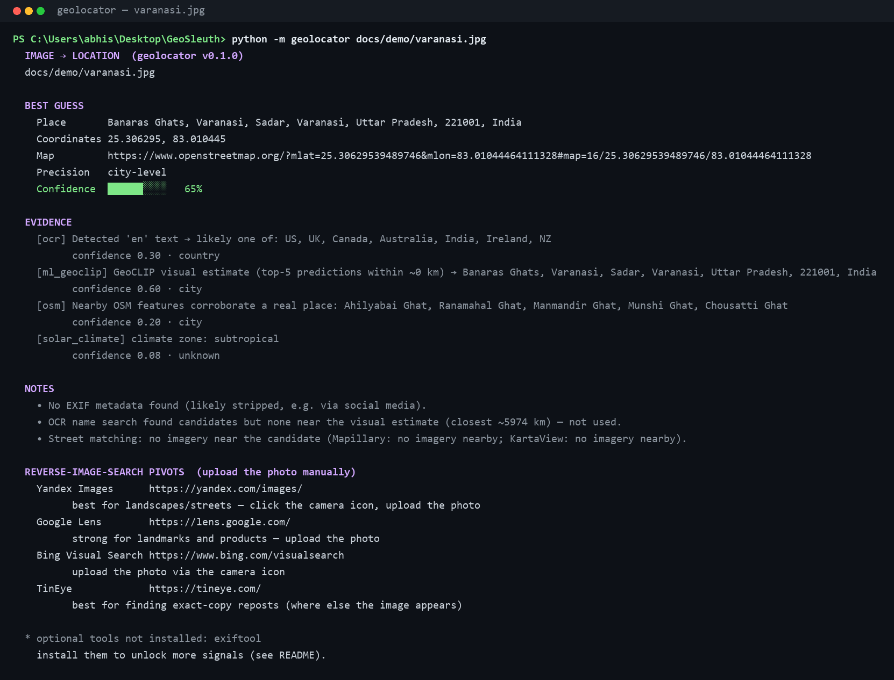
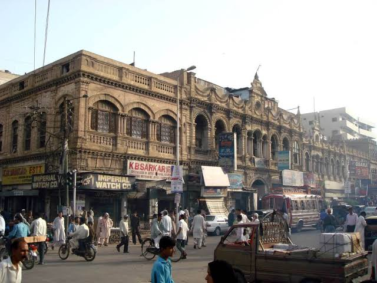
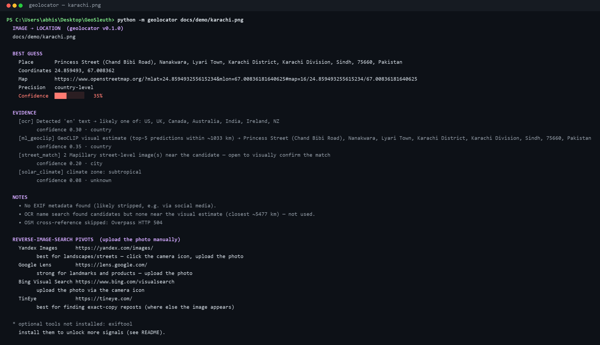

# GeoSleuth — image → location OSINT tool

Guess **where a photo was taken** from the image alone. Feed it a picture; it
runs a layered pipeline of location signals and returns a best-guess location,
a **confidence score**, and the **evidence trail** that produced it — never a
bare guess. *(The Python package and CLI are named `geolocator` / `geolocate`.)*

> **Status:** working end to end — EXIF & geocoding, OCR, the **GeoCLIP** and
> **GeoSeer** locators with a **StreetCLIP** cross-check, automated **reverse
> image search** (SerpAPI), corroboration layers (OSM · iNaturalist ·
> solar/climate · street imagery), a **web UI**, and 71 offline tests. See
> [what it does](#what-it-does-today) and the [Roadmap](#roadmap).

---

## Quickstart

```bash
# 1. Clone the repo
git clone <your-repo-url> geosleuth
cd geosleuth

# 2. (recommended) create a virtual environment — needs Python 3.9+
python -m venv .venv
source .venv/bin/activate          # Windows: .venv\Scripts\activate

# 3. Install everything (CLI, Web UI, local GeoCLIP + StreetCLIP, API locators)
pip install -e .            # or: pip install -r requirements.txt

# 4. REQUIRED: download the local models (GeoCLIP + StreetCLIP, ~3.3 GB, one-time)
python -m geolocator --download-models

# 5. (recommended) install the OCR engine
winget install UB-Mannheim.TesseractOCR                 # Windows
#    macOS:  brew install tesseract      Debian/Ubuntu:  sudo apt install tesseract-ocr

# 6. Run it — one image, a whole folder (batch), or the browser UI
python -m geolocator path/to/photo.jpg      # single image (or:  geolocate photo.jpg)
python -m geolocator path/to/folder/ --json # batch: every image in a folder → JSON
geolocate-ui                                # Web UI → http://127.0.0.1:5000
```

> **Both local models are required.** The tool **refuses to run until GeoCLIP and
> StreetCLIP are downloaded** (`python -m geolocator --download-models`, ~3.3 GB
> one-time) — so results are never judged on a crippled setup. StreetCLIP runs
> **by default** as a cross-check on every image. (The web UI's *Local models*
> panel downloads them with a progress bar instead.)
>
> A free **GeoSeer** API key is optional but recommended — when set, it becomes
> the strongest locator and a confident GeoSeer fix **short-circuits** the local
> models (`--full-workflow` runs everything). Full timings in
> [Requirements & setup time](#requirements--expected-setup-time).

---

## Demo

Three real runs on photos that have **no GPS metadata** — so the tool guesses
from pixels alone and reports exactly how sure it is, with the evidence trail.
Reproduce any of them: `python -m geolocator docs/demo/<image>`.

### 1 · Landmark — Sydney Opera House *(public-domain photo)*





**✅ Sydney, Australia — city-level, 60%.** GeoCLIP's top-5 predictions clustered
within ~0 km; OSM independently surfaced *Man O' War Steps*, on the Opera House
forecourt.

### 2 · No-metadata street — Varanasi, India





**✅ Varanasi, India — city-level, 65%.** Pinned the Banaras ghats; OSM
corroborated with real neighbouring ghats (Ahilyabai, Manmandir, Munshi…), and a
detected-language hint consistent with India nudged confidence up.

### 3 · Colonial street — Karachi, Pakistan





**✅ Karachi, Pakistan — country-level, 35%.** The honest case: GeoCLIP's top-5
spread ~1,000 km, so it reports *country*-level rather than faking a pinpoint —
the trustworthy part of the answer is **Pakistan**. English shop signs don't
narrow it further, which is exactly what the reverse-image-search pivots are for.

### Results at a glance

| Photo | Best guess | Truth | Correct? | Confidence |
|-------|-----------|-------|----------|------------|
| Sydney | Sydney, NSW, Australia | Sydney | ✅ city | 60% |
| Varanasi | Varanasi, UP, India | Varanasi | ✅ city | 65% |
| Karachi | Karachi, Sindh, Pakistan | Karachi | ✅ country | 35% |

Every result ships with its **confidence** and **evidence trail** — never a bare pin.

> Screenshots are captured from real runs (`docs/demo/shots/`). Confidence
> honestly tracks how sure the model is: tight prediction clusters read higher,
> a wide spread reads lower.

---

## What it does today

| Signal | What it gives you | Reliability |
|--------|-------------------|-------------|
| **EXIF GPS** → Nominatim | Exact coordinates + full street address | ★★★★★ when GPS is present |
| **EXIF metadata** | Camera, timestamp, timezone-offset longitude hint | context only |
| **OCR** (Tesseract) | Visible text → detected language → candidate countries | ★★☆ coarse hint |
| **ML estimate** (GeoCLIP) | Predicted coordinates from visual content alone — the no-metadata workhorse | ★★★☆ on distinctive scenes, honestly low on generic/indoor |
| **GeoSeer AI** (opt-in key) | Dedicated geolocation API (GeoSpy-style) → coordinates + address + confidence; strongest single locator | ★★★★ (free tier ~10/day) |
| **OCR place lookup** | A business/place name OCR reads, geocoded and cross-checked against the visual estimate | ★★★★ when it matches — turns a sign into coordinates |
| **StreetCLIP** (on by default) | Independent 2nd model's country vote; agrees→boost, disagrees→re-rank/override GeoCLIP | cross-model corroboration + **error correction** |
| **License plate** | Distinctive plate format in OCR text → country | ★★☆ conservative |
| **OSM cross-ref** (Overpass) | Named features near the candidate — corroborates a real place | corroboration |
| **iNaturalist** | Species actually observed near the candidate — corroborates the biome | corroboration (keyless) |
| **Solar / climate** | Timezone↔longitude consistency, sun elevation, climate zone | corroboration / sanity check |
| **Street match** (Mapillary / KartaView) | Nearby street-level imagery to visually confirm the guess | pivot / corroboration |
| **Reverse image search** (SerpAPI) | Automated Google Lens — finds the source page whose title names the place; the strongest signal for web-sourced photos | ★★★★ when the image is online (needs key) |
| **Reverse-search pivots** | Ready-to-open Yandex/Lens/Bing/TinEye upload links (keyless, manual) | manual next step |

The pipeline runs stages in priority order (cheap & deterministic first):

```
EXIF → reverse-search pivots → OCR+plates → GeoSeer → GeoCLIP → [StreetCLIP]
     → OCR place lookup → street match → OSM cross-ref → iNaturalist → solar/climate
```

**Layering rules that keep it honest:**
- The **most precise** signal wins the location; corroboration only nudges confidence, capped so weak hints never impersonate a GPS fix.
- **GeoSeer runs first** (when its key is set): a confident GeoSeer fix **short-circuits** the slow local GeoCLIP entirely (`--full-workflow` runs both).
- The **GeoCLIP** stage runs only when there's no exact GPS and GeoSeer didn't already nail it — and its confidence comes from how tightly its top-5 guesses cluster (scattered → low-confidence, country-level at best).
- The **solar** stage can *contradict* a guess: if the EXIF timezone offset is inconsistent with the candidate longitude, it says so.

---

## Install

**Prerequisite:** Python **3.9+** (`python --version`).

### 1. Install (one command, everything included)

```bash
pip install -e .            # or: pip install -r requirements.txt
```

That's the whole thing — CLI, web UI, API locators (GeoSeer), and the local
**GeoCLIP** model. There are no install profiles to choose between.

- **torch** — ~200 MB download / ~2 GB installed; the pinned CPU build runs
  anywhere. For GPU, install the CUDA build from [pytorch.org](https://pytorch.org) instead.
- **GeoCLIP** downloads its weights (**~1.7 GB**, CLIP-ViT-L/14) on the **first
  run**, then caches them under `~/.cache/huggingface` (or fetch them ahead of
  time from the [Web UI](#web-ui) with a progress bar).
- **StreetCLIP** is **required and on by default** (a cross-check on every image);
  its ~1.6 GB weights come down with `--download-models`. The tool won't analyse
  until both models are present. Disable with `--no-streetclip` only if you know
  what you're giving up.
- `transformers` is pinned `<5` — GeoCLIP's encoder targets the 4.x CLIP API and
  5.x breaks inference.

### 2. External binaries (recommended)

Auto-detected; the tool degrades gracefully if they're missing.

| Tool | Enables | Install |
|------|---------|---------|
| **Tesseract** | OCR (text / language / plate signals) | Windows: `winget install UB-Mannheim.TesseractOCR` · macOS: `brew install tesseract` · Linux: `apt install tesseract-ocr` |
| **ExifTool** | Comprehensive EXIF (RAW/HEIC/XMP) | Windows: download from [exiftool.org](https://exiftool.org), rename `exiftool(-k).exe`→`exiftool.exe` onto `PATH` · macOS: `brew install exiftool` · Linux: `apt install libimage-exiftool-perl` |

> On Windows the tool **auto-detects Tesseract** at `C:\Program Files\Tesseract-OCR`,
> so the `winget` install works with no `PATH` editing. Without Tesseract, OCR is
> skipped; without ExifTool, EXIF still works via the pure-Python `exifread`/Pillow
> fallback.

### Requirements & expected setup time

| Step | Download | Approx time |
|------|----------|-------------|
| `pip install` — core + flask + torch + geoclip + transformers | ~250 MB | ~4–6 min |
| Tesseract binary (optional, OCR) | ~50 MB | ~1–2 min |
| First **GeoCLIP** run — downloads CLIP-ViT-L/14 weights | ~1.7 GB | ~8–12 min |
| First **StreetCLIP** run — 2nd model weights (required) | ~1.6 GB | ~8–12 min |

**Total to first result ≈ 15–20 min**, dominated by the `torch` install and the
one-time ~1.7 GB GeoCLIP download (figures assume ~30 Mbps). **Steady state with
local models: ~30–90 s per image on CPU** — mostly model load — and ~5–15 s each
for later images in a **batch** (loads once). With a **GeoSeer** key the local
model is short-circuited on a confident fix, so most images resolve in a few
seconds without loading GeoCLIP at all. A GPU makes local inference near-instant.

---

## Usage

```bash
# Human-readable report
python -m geolocator path/to/photo.jpg

# Machine-readable JSON (add --verbose to include raw evidence)
python -m geolocator path/to/photo.jpg --json
python -m geolocator path/to/photo.jpg --json --verbose

# Batch: several files, or a whole directory (JSON becomes an array).
# The GeoCLIP model loads once and is reused across the batch.
python -m geolocator a.jpg b.jpg c.jpg
python -m geolocator ./my_photos/ --json

# If installed with `pip install -e .`
geolocate path/to/photo.jpg
```

### Example output (image with GPS metadata)

```
  IMAGE → LOCATION  (geolocator v0.1.0)
  photo.jpg

  BEST GUESS
    Place       Avenue Gustave Eiffel, 7th Arrondissement, Paris, 75007, France
    Coordinates 48.858400, 2.294500
    Map         https://www.openstreetmap.org/?mlat=48.8584&mlon=2.2945#map=16/48.8584/2.2945
    Precision   exact coordinates
    Confidence  ██████████   95%

  EVIDENCE
    [exif] GPS coordinates embedded in image metadata → Avenue Gustave Eiffel …
          confidence 0.95 · exact
```

### Customize the query (choose which signals run)

```bash
# With a GeoSeer key: a confident GeoSeer fix short-circuits the local model.
python -m geolocator photo.jpg --geoseer-key gsk_...

# Force the local model to run too, even when GeoSeer is confident
python -m geolocator photo.jpg --geoseer-key gsk_... --full-workflow

# GeoSeer only — never run the local model (fastest; no GeoCLIP load)
python -m geolocator photo.jpg --geoseer-only --geoseer-key gsk_...

# Add the StreetCLIP second opinion / turn individual signals off
python -m geolocator photo.jpg --streetclip
python -m geolocator photo.jpg --no-geoclip --no-inaturalist
```

Every signal has a `--x` / `--no-x` flag (`--geoclip`, `--geoseer`, `--streetclip`,
`--ocr`, `--street-match`, `--osm`, `--inaturalist`, `--solar`), plus
`--geoseer-key` / `--mapillary-token` to pass keys without env vars.

## Web UI

A local browser app to upload an image, paste API keys, tick exactly which
signals to run, and **download the local models with a progress bar** (then tick
them to use). It's part of the standard install:

```bash
pip install -e .             # or: pip install .
geolocate-ui                 # → http://127.0.0.1:5000

# ...or without installing the package (run from the source folder):
python -m geolocator.webui   # → http://127.0.0.1:5000
```

- Enter your **GeoSeer**/**Mapillary** keys in the form (kept in memory, never saved).
- Toggle signals, or hit **GeoSeer-only** to run without any local model.
- The **Local models** panel shows GeoCLIP/StreetCLIP status; if not downloaded,
  a **Download** button fetches the weights and shows live progress, then enables
  the matching toggle. Binds to localhost only.

> **The UI downloads model *weights*, not Python packages.** The packages
> (`torch`/`geoclip`/`transformers`) come with the standard `pip install`, so the
> Download button just fetches the large weight files with a progress bar.
> **GeoCLIP and StreetCLIP are two separate downloads** — GeoCLIP ~1.7 GB (used by
> default), StreetCLIP ~1.6 GB (also required). Each has its own button; they're never
> fetched together.

---

## How confidence works

Every stage emits **signals** — a finding + how much we trust it + how precise
it is (`exact` / `city` / `region` / `country` / `unknown`).

- The **most precise** signal wins the location slot. An exact GPS fix always
  beats a country-level language hint.
- **Locating vs. enrichment.** Only *independent locating* signals — ones that
  on their own say *where* the photo was taken (EXIF GPS, the ML estimate, an
  OCR place-name match, a StreetCLIP country vote, a plate country) — can raise
  confidence when they agree, and the bonus is capped so weak hints never reach
  GPS-grade certainty. *Enrichment* signals (nearby OSM features, "street
  imagery exists nearby", climate zone) are shown as evidence but **never boost
  the number** — they'd fire for any real place and would inflate even a wrong
  guess. So a GeoCLIP-only guess reports the model's own confidence, not a
  padded one.
- **Agreement must be real.** A corroborating signal only counts if it actually
  agrees with the winner: a coordinate-bearing hint must be within ~200 km, and
  a country-level hint's candidate countries must include the winner's country.
  A hint pointing elsewhere is excluded (and, for the second model, surfaced as
  a disagreement caution).
- **Enrichment never wins the location slot.** Only locating signals can become
  the reported location — an OSM/street-match signal describes a candidate but
  can't hijack the answer with a placeless coordinate.
- GPS is scored **0.95, not 1.0**: EXIF can be spoofed, stale, or reflect where
  a photo was *edited* rather than shot.
- The solar stage can **lower** trust: a timezone offset inconsistent with the
  candidate longitude is flagged as a warning.
- **Model disagreement lowers trust too.** When the optional StreetCLIP second
  model contradicts GeoCLIP's country, confidence is cut and the guess is
  re-ranked or overridden toward the agreed country — the tool won't keep
  presenting a confident-but-contradicted location (see the StreetCLIP note under
  [Configuration](#configuration-environment-variables)).

This transparency is deliberate — for OSINT work, the reasoning matters as much
as the answer.

---

## A note on accuracy expectations

Run the tool **properly first** — it requires GeoCLIP + StreetCLIP downloaded
(`--download-models`) and refuses to run otherwise, precisely so accuracy isn't
judged on a half-configured setup.

- **With GPS metadata:** 95%+ correct — essentially solved.
- **Distinctive scenes** (landmarks, recognisable skylines): the local models do
  well, often **city-level** — in testing, 11/12 world landmarks were correct.
- **Generic street/indoor photos** (e.g. random reddit/Pinterest city pics): this
  is the genuinely hard case. The local models reliably get the **country** but
  the **exact city/coordinates are often wrong or low-confidence** — and the tool
  says so via its confidence score rather than faking a pinpoint.
- **For exact locations on hard photos, add a GeoSeer key** (`GEOSEER_API_KEY`).
  It's a dedicated geolocation AI and is the realistic path to building/street-
  level accuracy on generic images — with the local models alone, treat a
  low-confidence pin as "right country, best guess," not a verified location.

---

## Roadmap

| Phase | Adds | Notes |
|-------|------|-------|
| **1 — done** | EXIF → Nominatim, OCR → language hint, confidence engine, CLI | the reliable core |
| **2 — done** | ML geo-estimation via GeoCLIP (image → coordinates, local inference) | the real no-metadata workhorse; needs a few GB RAM, GPU ideal |
| **3 — done** | Solar/timezone consistency (pysolar), climate-zone descriptor, OSM cross-ref (Overpass) | corroboration layer |
| **4 — done** | Reverse-search pivots (Yandex/Lens/Bing/TinEye), street matching (Mapillary + keyless KartaView), license-plate region | best-effort; keyed APIs gated behind env vars |
| **beyond — done** | GeoSeer AI locator + short-circuit, StreetCLIP cross-check & disagreement resolver, OCR→place-name lookup, iNaturalist biome, batch mode, config-driven queries, web UI | added on top of the phased plan |

### What's intentionally left for later / needs your input

| Item | Why it's not automatic | To enable |
|------|------------------------|-----------|
| **GeoSeer AI locator** | strong AI geolocation, needs a free API key (~10/day) | set `GEOSEER_API_KEY` (from [geoseeer.com](https://geoseeer.com)); becomes the primary locator when confident |
| **Mapillary street matching** | better global coverage, needs a free API token | set `MAPILLARY_TOKEN` (see [dashboard](https://www.mapillary.com/dashboard/developers)); without it, street matching still works via keyless **KartaView** (sparser outside Europe) |
| **Automated reverse image search** | now available via **SerpAPI** (Google Lens) — legitimate, no scraping | set `SERPAPI_API_KEY` (free ~100/mo). Note: it briefly uploads the image to a temporary public host so Lens can fetch it. Without a key, the manual pivot links still work |
| **Flora → region from the image** | needs a plant-ID vision model | iNaturalist is wired in the *other* direction (candidate coordinate → nearby species, as biome corroboration) |
| **Shadow-angle → latitude** | needs CV shadow detection in the image | Phase 3 currently does the metadata-side solar check instead |

The pipeline (`geolocator/pipeline.py`) defines every stage in `STAGES` — adding
a new signal means writing one function and slotting it in.

---

## Configuration (environment variables)

| Variable | Effect |
|----------|--------|
| `GEOSEER_API_KEY` | enables the GeoSeer AI locator (strong 3rd opinion; **free tier ~10 requests/day** — best on single important images, not big batches) |
| `SERPAPI_API_KEY` | enables **automated reverse image search** (Google Lens; free ~100/mo) — the strongest signal for photos taken from the public web. Briefly uploads the image to a temporary public host so Lens can fetch it |
| `MAPILLARY_TOKEN` | prefers Mapillary for street matching (better coverage); without it, keyless KartaView is used |
| `GEOLOCATOR_STREETCLIP` | StreetCLIP is **on by default**; set to `0` to disable the second-model cross-check |
| `NO_COLOR` | disables ANSI colour in the terminal report |

> **StreetCLIP note:** the cross-check loads `geolocal/StreetCLIP` (~1.6 GB,
> CLIP-ViT-L/14, fetched by `--download-models`); after that it's practical even
> on CPU (~27 s to load + ~3 s per image). It runs **by default** on every image
> because it measurably improves the hard cases (it caught a photo GeoCLIP put in
> Brazil and corrected it to India). Disable with `--no-streetclip` if you must.
>
> **What it does on disagreement.** When StreetCLIP's country differs from
> GeoCLIP's guess, the tool resolves it in order: **(1) re-rank** — if any of
> GeoCLIP's own top-5 predictions is in StreetCLIP's country, promote that one
> (keeps coordinates); **(2) country-override** — otherwise report StreetCLIP's
> country at country-level and demote GeoCLIP's contradicted coordinates to
> evidence; **(3) down-weight** — always cut confidence on disagreement. It never
> overrides an exact EXIF GPS fix.
>
> **Measured effect** (test photos with no metadata): GeoCLIP alone mislabeled a
> Jakarta CBD as *Mexico City* (60%) and a Jakarta street as *Taiwan*; with
> StreetCLIP on, both correctly resolved to **Indonesia** (country-level, honest
> ~30%), while a correctly-placed Bali temple was *boosted*, not changed.

## Project layout

```
geolocator/
  cli.py            CLI + report formatting + signal-selection flags
  pipeline.py       stage orchestration + confidence aggregation
  models.py         Signal / GeoResult / AnalyzeConfig data structures
  # Phase 1 — reliable core
  exif.py           EXIF extraction (exiftool → exifread → Pillow fallback)
  geocode.py        Nominatim reverse + forward (place-name) geocoding
  ocr.py            Tesseract OCR (upscale/contrast/multi-PSM) + langdetect
  # Phase 2 — ML / AI locators
  geoestimate.py    GeoCLIP image → coordinates (local model)
  geoseer.py        GeoSeer AI geolocation API (opt-in key, ~10/day free)
  secondmodel.py    StreetCLIP zero-shot country cross-check (opt-in)
  # Phase 3 — corroboration
  solar.py          timezone↔longitude + sun-elevation checks (pysolar)
  climate.py        coarse latitude/climate-zone descriptor
  osm.py            Overpass nearby-feature cross-reference
  inaturalist.py    iNaturalist nearby-species biome corroboration (keyless)
  # Phase 4 — best-effort external
  plates.py         license-plate format → country hint
  reverse_search.py reverse-image-search pivot links (keyless, manual)
  reverse_search_api.py automated Google Lens via SerpAPI (opt-in key)
  street_match.py   Mapillary (token) + KartaView (keyless) street imagery
  # UI + config
  webui.py          Flask browser app (keys, toggles, in-UI model downloads)
  modelmgr.py       local-model status + download-with-progress
tests/
  test_pipeline.py  71 offline tests (no network / binaries needed)
COVERAGE.md         spec → implementation traceability (what shipped / substituted / skipped)
```

---

## Legal & ethical use

This is an OSINT research tool. Geolocating images can implicate people's
privacy and safety. Use it only on images you're authorized to analyze, in
line with applicable law and platform terms. The reverse-image-search and
scraping layers (Phase 4) must respect each site's terms of service and rate
limits — the tool does **not** attempt to bypass CAPTCHAs or bot detection.
